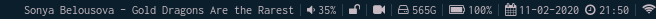

# personalblocks
my personal i3blocks blocklets written in Go

This is written for my setup [here](https://github.com/ihebchagra/dotfiles "ihebchagra/dotfiles")




## Usage:

```
personalblocks [command]

List of commands:
-battery
-mail
-music
-news
-nmblocks
-root
-screenawake
-screencast
-sounds
-time
-torrent
-volume
```

## Building:

```
$ go build main.go
```

## Software it uses:
* Font Awesome 4 for icons
* acpi for battery
* neomutt for mail
* mpd + mpc + ncmpcpp for music
* newsboat for rss
* networkmanager's nmcli for network icons + tui
* ffmpeg for screencast
* deluge for torrents
* pulsemixer for audio detection
